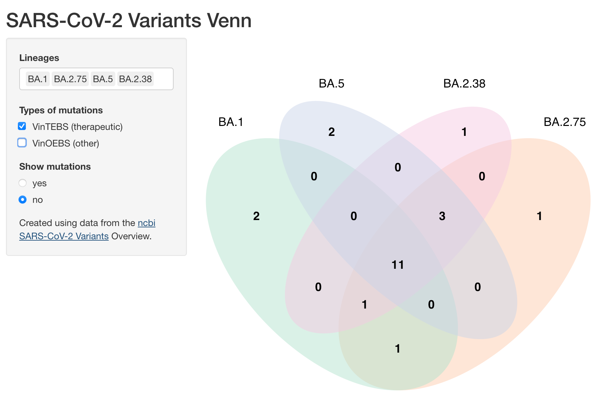
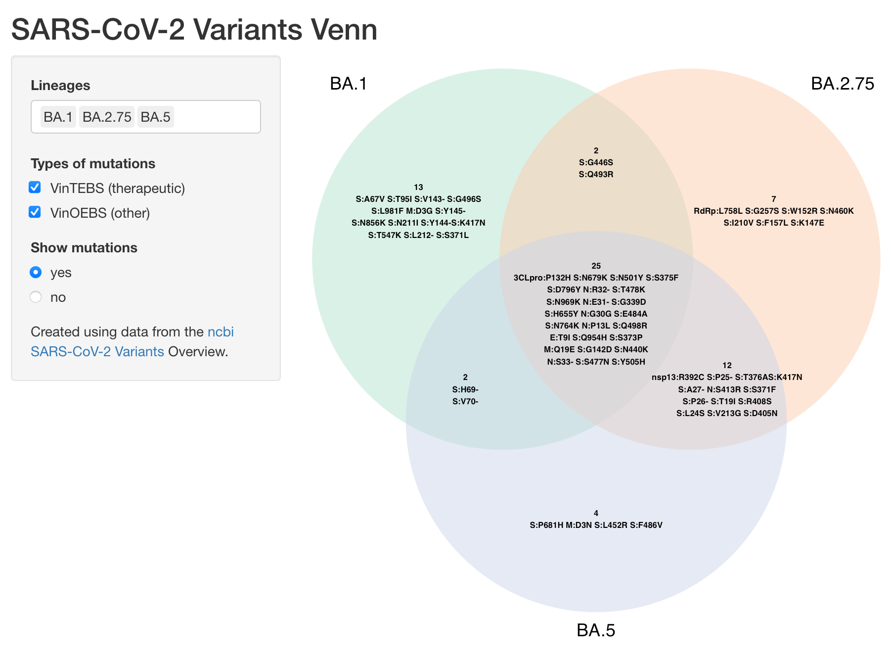

# Covid Venn

Shiny app for creating Venn diagrams of SARS-CoV-2 variant/lineage mutations.



## Installation

Clone the repo from github.
```
git clone https://github.com/MDU-PHL/covid-venn.git && cd covid-venn.git
```

Install dependencies.

```
install.packages('shiny', 'VennDiagram', 'RColorBrewer')
```

## Running

Start the shiny server.

```R
shiny::runApp()
```

Shiny server can also be started from `bash`

```bash
Rscript -e "shiny::runApp()"
```

Navigate to the URL printed in the console.



By default 3 lineages are selected. You can modify this selection using the *Lineages* select input. Up to 4 lineages can be compared. 

There are three types of mutations that can be selected: Defining, VinTEBS (Variations in therapeutic epitopes or binding sites), and VinOEBS (Variations in other epitopes or binding sites).

Mutation labels can be shown using the *Show mutations* radio buttons. 

## Data

`Covid-venn` uses data from the [ncbi](https://www.ncbi.nlm.nih.gov/activ) and downloads the latest version of the database each time it runs. If the database is unavailable covid-venn will default to using a local copy of the database (which may be out of date).
